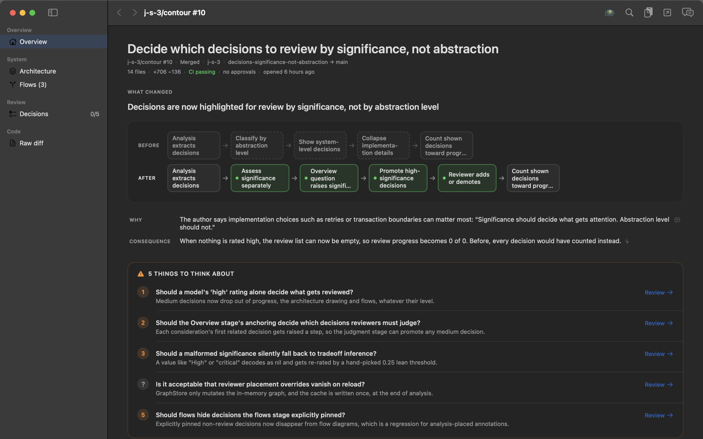
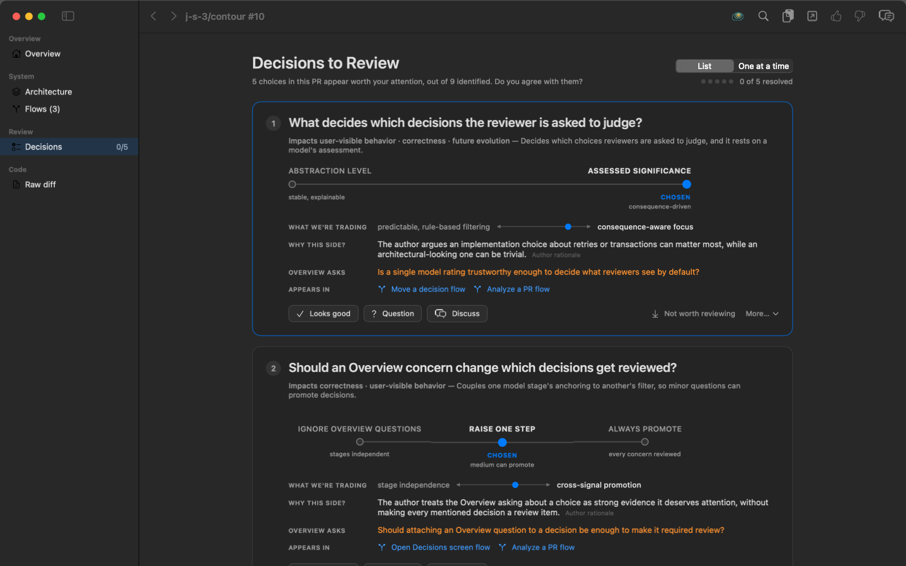
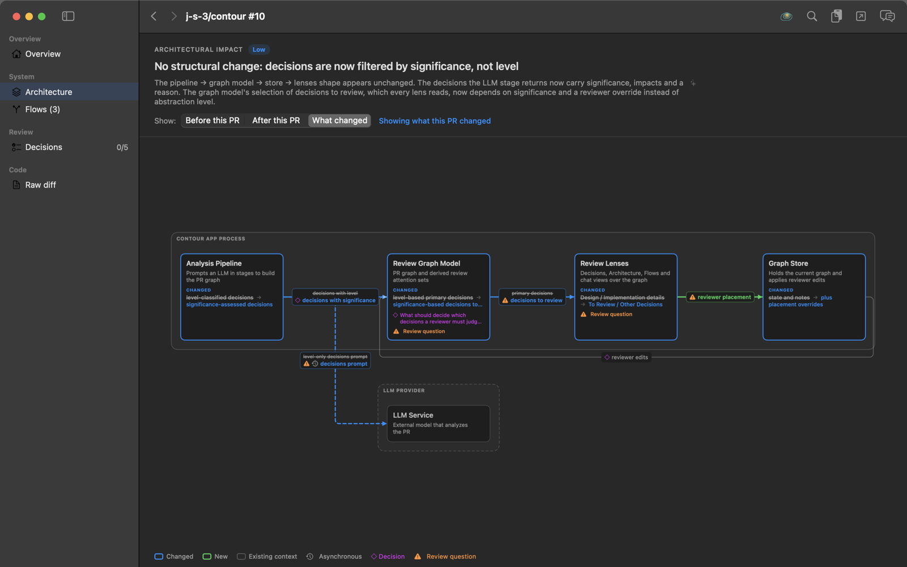
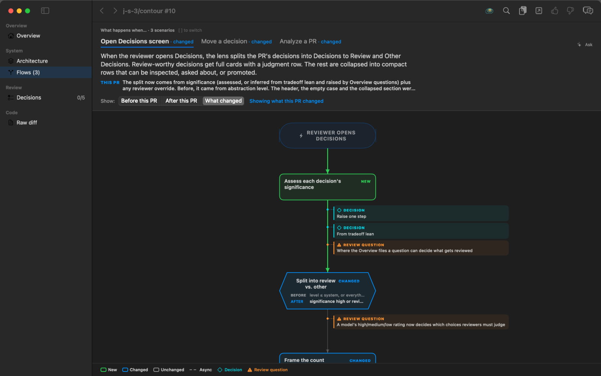
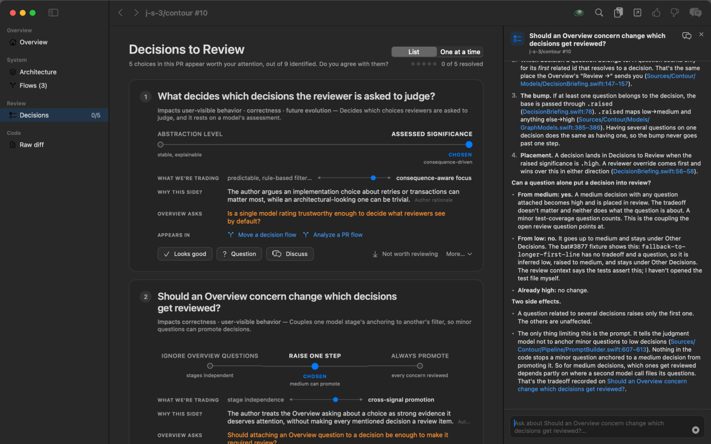
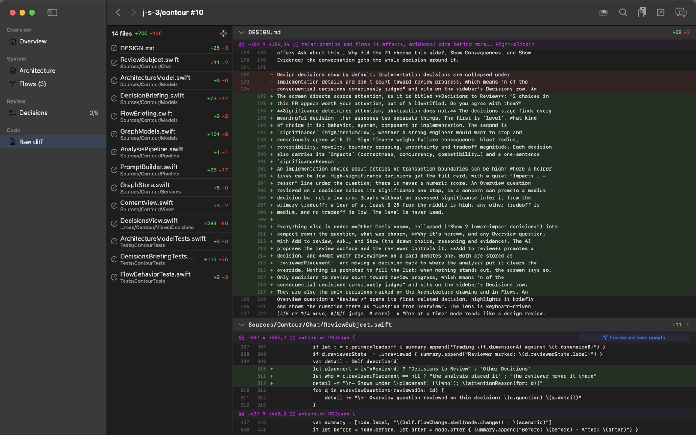
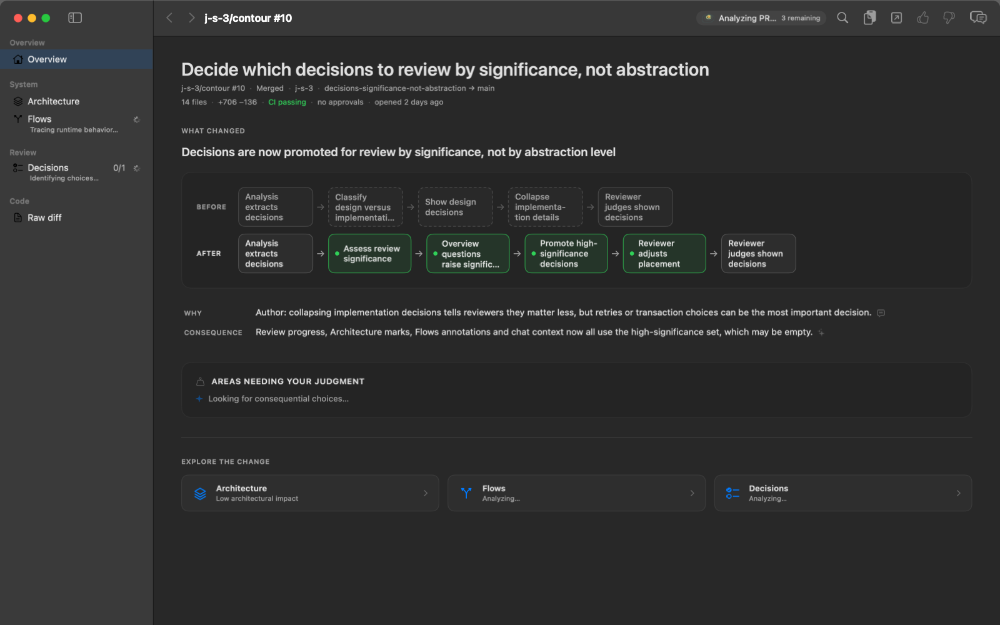

<p align="center">
  <picture>
    <source media="(prefers-color-scheme: dark)" srcset="Assets/Logo/contour-logo-dark.svg">
    
  </picture>
</p>

# Contour

[](https://github.com/j-s-3/contour/actions/workflows/build.yml)
[](https://github.com/j-s-3/contour/actions/workflows/build.yml)

**Review the decisions, not the diff.**

Most of the code in a pull request is now written by a machine. Reading it line by line
is the wrong job for the one human in the loop. Contour is a native macOS app that turns a
GitHub pull request into a briefing: what changed, what the code now does, which
engineering decisions it made, what each one traded away, and where your judgment is
actually needed. Every claim carries a link to the lines behind it.

<p align="center"></p>

> **Status:** early and experimental. Expect rough edges and breaking changes.

## Install

With [Homebrew](https://brew.sh). The repo is its own tap:

```sh
brew tap j-s-3/contour https://github.com/j-s-3/contour
brew install --HEAD j-s-3/contour/contour
contour
```

There are no tagged releases yet, so this builds the latest `main` from source. It needs
Xcode 27 (Swift 6.4). `brew upgrade --fetch-HEAD contour` pulls newer commits.

Or build it yourself:

```sh
swift build
swift run Contour
```

Either way, you also need `git` and one AI CLI you're already signed in to (`pi` or
Claude Code). See [Requirements](#requirements) below. A setup wizard on first launch
checks what you have.

## A tour, on Contour's own code

Every screenshot below is Contour reviewing one of its own pull requests,
[#10](https://github.com/j-s-3/contour/pull/10), *"Decide which decisions to review by
significance, not abstraction"*. It touches 14 files (+706 −136). These are real outputs
of a normal run with Claude Code as the harness, not mockups.

### Start with a briefing, not a file list

The **Overview** reads like a colleague's handoff. It says in one line what the PR
changes, shows the behavior before and after as a chain of steps, and says *why* the
change was made. A short **What this means** list says what the change implies for the
system. Then come the few **areas needing your judgment**, each a small decision brief
written so you can make the call before you open the diff: the context you need, why it
matters, the tradeoff when there is a real one, and the one neutral question you're being
asked to judge. There are only as many as the PR warrants. Size, CI status, approvals and
age sit in the header. Each "Review →" takes you to the evidence, the analysis's
assumptions, and the decision the item is about, so you can check the analysis rather than
reconstruct it.

### Judge the decisions that matter

<p align="center"></p>

Contour pulls out every meaningful choice the implementation made. It then asks which of
them a strong senior engineer would want to stop and consciously agree with. Here it
found 9 decisions and put 5 in front of you. Each is drawn as a choice between real
alternatives, with **what it traded**, **why it landed on that side** (quoting the author
where it can), the questions raised about it, and every flow it appears in. You judge
each one: *Looks good*, *Question*, or *Discuss*. You can also move a decision in or out
of the list. The AI briefs you and never gives a verdict. That call stays yours.

### See the shape of the change

<p align="center"></p>

**Architecture** is a whiteboard sketch of the parts the PR touches, not a class diagram.
Changed contracts appear as struck-through old versions beside the new ones. Decisions and
open questions are pinned to the parts they concern. You can flip between *Before this
PR*, *After this PR* and *What changed*.

### Follow what actually happens at runtime

<p align="center"></p>

**Flows** traces the behavior the PR changes as a series of scenarios ("what happens
when…"). New and changed steps are marked, each with its before and after. The decisions
and review questions that apply are attached to the exact step where they take effect.

### Ask about anything, get answers that cite code

<p align="center"></p>

Right-click any decision, part, flow step or piece of code and choose **Ask about this…** (⌘⇧A).
The conversation starts from that element and knows everything connected to it. The model
reads the real checkout and answers with clickable `path:line` citations. Each citation
opens the code and keeps your place in the review.

### And the diff is still one click away

<p align="center"></p>

The **raw diff** has a file list, hunks and line numbers. Hunks link back to the flows
and decisions they implement, so reading code never loses the thread.

### No waiting for the whole analysis

<p align="center"></p>

The review opens as soon as the PR is fetched and fills in while you read. Independent
stages run in parallel, and decisions and flows stream in one at a time. Each section
fails and retries on its own, and you can stop a run and resume it section by section.
Reopening a PR you've analyzed before is instant. If it has new commits, you see the
previous analysis, clearly marked, while the new one runs.

### Stacked pull requests

When a pull request is one layer of a stack, Contour notices from the branch chain alone and
shows the whole stack under the title: part 3 of 7, one chip per layer, click to open any of
them. Each layer is reviewed on its own diff, and the analysis is told which layers are
already in the checkout and which build on this one, so code that nothing calls yet is read
as a later layer's job rather than dead code. Next and previous layer are in the File menu
(⌥⌘] and ⌥⌘[) and in ⌘K.

## Why trust it

- **Provenance on every statement.** Everything the app says is tagged as an observed
  fact, an author claim, or an AI interpretation, and interpretations carry a confidence.
  Contour never presents an inference as a fact.
- **Everything links back to code.** Each part, decision, tradeoff and flow step cites
  `path:startLine-endLine` in the real checkout. Citations that don't resolve are caught,
  and the statements resting on them are demoted.
- **Safe on untrusted PRs.** Every model call is single-shot and read-only. It refuses
  to load any `CLAUDE.md`, `AGENTS.md`, skill, hook or plugin *from the pull request*,
  because on a PR from the internet those files are attacker-controlled.
- **No lock-in, no credentials.** Contour drives an AI CLI you already use (`pi` or
  Claude Code), reads GitHub through `gh` or the anonymous API, and looks up the
  originating issue in GitHub Issues or Jira. It stores no provider keys.

Also: a command palette (⌘K) that jumps to any lens or node, a focused code viewer with
a guaranteed way back, **Approve** and **Request changes** buttons that submit your
verdict to GitHub through `gh`, *Open on GitHub* and *Copy review summary* to take your
review elsewhere, and opening a PR from the clipboard, a dropped link, or the start
screen's lists: PRs awaiting your review, PRs you opened recently, and the open PRs of
any repository you choose to watch.

Not yet: posting line comments back to GitHub, LSP-grade jump-to-definition, and sharded
analysis for very large PRs (see `DESIGN.md` §17/§18). `DESIGN.md` has the full product
and technical design.

## Requirements

- macOS 15+ with a Swift 6.4 toolchain (the package declares `swift-tools-version: 6.4`).
- `git`.
- **One AI harness**, either:
  - `pi`, configured with at least one working model (`pi --list-models`), or
  - `claude` (Claude Code) 2.1.24+ — earlier builds lack the `--restricted` and
    `--safe-mode` flags Contour uses to harden each run.

That's the whole list. Everything below is optional:

- `gh` — **only needed for private pull requests, and for approving or requesting
  changes from the app.** Public PRs are read through GitHub's anonymous REST API, so
  Contour works on a machine with nothing but `git` and a harness.
- `acli` — only needed if you want Jira instead of GitHub issues for issue lookup.

On first launch a setup wizard probes for all of these and tells you what it found, what
each one buys you, and what (if anything) is actually missing.

## Configuration

Everything is in Settings (⌘,): which harness to drive, how to reach GitHub, which issue
tracker to use, and optional per-tier model overrides.

Environment variables override the stored settings, which is how tests and scripts pin
behavior. Precedence is **environment > stored setting > what's detected on the machine**.

| Variable | Values | Effect |
| --- | --- | --- |
| `CONTOUR_HARNESS` | `pi`, `claude` | Which AI CLI to drive |
| `CONTOUR_TRACKER` | `github`, `jira`, `none` | Where to look for the originating issue |
| `CONTOUR_GITHUB_ACCESS` | `auto`, `gh`, `anonymous` | How to reach GitHub |
| `CONTOUR_MOCK_ANALYSIS` | `1` | Use canned analysis (and canned chat answers) instead of calling a model |
| `CONTOUR_MOCK_LATENCY` | a scale, e.g. `1` | With mock analysis, make each stage take about as long as a real one, so progressive opening can be seen |
| `CONTOUR_MOCK_FAIL_STAGE` | a stage, e.g. `architecture` | With mock analysis, fail that stage once, to exercise its failure and Retry |
| `CONTOUR_OPEN_PR_URL` | a PR URL | Open straight into that PR on launch |
| `CONTOUR_DUMP_STAGES` | a directory | Write each stage's raw JSON there |
| `CONTOUR_DISABLE_WATCHDOG` | `1` | Debug builds only: turn off the main-thread block watchdog (on by default; logs a block over 250ms) |

### Harness

Contour holds no provider credentials. It shells out to a CLI you have already installed
and signed in to, and inherits whatever model and provider that CLI is configured with.
By default it passes no model flag at all, so each CLI's own default applies; a bare
pattern like `sonnet` can match an unauthenticated provider when several are configured,
so set the per-tier overrides only if you know which model you want.

Every invocation is single-shot, ephemeral, and restricted to read-only tools. It also
refuses to load any `CLAUDE.md`, `AGENTS.md`, skill, hook, or plugin **from the checkout** —
the checkout is the pull request under review, so for any PR off the internet those files
are attacker-controlled content that would otherwise arrive as instructions.

### GitHub access

`auto` (the default) uses `gh` when it's installed and authenticated — private repos, and
a 5000 requests/hour limit — and otherwise falls back to the anonymous API, which reads
public PRs with no setup at all at 60 requests/hour.

Because `gh` is preferred whenever it's present, the anonymous path is the one that gets
exercised least while being the one a new user hits first. `anonymous` forces it, so you
can check that path deliberately rather than hoping.

### Issue tracker

The linked issue grounds the plain-language "problem to be solved" summary in what was
actually asked for, rather than in what the diff appears to do. GitHub issues are the
default and need nothing installed: Contour reads closing keywords (`Fixes #123`),
cross-repo references (`owner/repo#123`), bare `#123` mentions, and issue numbers embedded
in branch names.

Jira is offered only when `acli` is on your PATH, and stays off until you turn it on —
detecting `acli` never changes where Contour looks on its own.

A missing, unreachable, or unparseable issue never fails a review.

## Tests

```sh
swift test                                   # unit tests only, no network, fast
RUN_CONTOUR_INTEGRATION=1 swift test         # + real pipeline runs against a public PR
```

The integration tests hit the network and a real model, so they're gated behind an env
var. They target a public PR, so they need no private-repo access, and both the harness
and the GitHub path are parameterized:

```sh
RUN_CONTOUR_INTEGRATION=1 CONTOUR_HARNESS=claude swift test --filter IntegrationSmoke
RUN_CONTOUR_INTEGRATION=1 CONTOUR_GITHUB_ACCESS=anonymous swift test --filter IntegrationSmoke
```

`Tests/ContourTests/Fixtures/` holds captured real output used as regression fixtures —
see its `README.md` for what came from where, including one fixture that is partly
synthesized and why.

`swift test --filter BenchTests` measures Contour's own latency — diff parsing, graph
assembly, verification, linking — against a deterministic fixture corpus of small,
medium and large PRs, run through `CONTOUR_MOCK_ANALYSIS` so no model or network is
involved. It prints a per-milestone table (see `LatencyMilestone`) and fails on a
large-multiple regression; CI runs it on every build. `scripts/summarize-metrics.py`
reports the same p50/p95 breakdown from a real `metrics.jsonl` collected over normal use.

`CorpusRunTests` runs the same pipeline against a small corpus of real, long-merged public
PRs (`Fixtures/corpus.json`) instead of one, and records per-stage failure/retry rates,
unverifiable citations and latency — a nightly workflow
(`.github/workflows/nightly-corpus.yml`) runs it once a day so model-shaped instability
shows up as a trend. Also gated behind `RUN_CONTOUR_INTEGRATION`; see
`Tests/ContourTests/Fixtures/README.md` for running it and summarizing its results locally.

## Manual testing without waiting on a model

```sh
CONTOUR_MOCK_ANALYSIS=1 swift run Contour
```

The GitHub fetch and local checkout still run for real (so the code viewer and Evidence
lens have real files), but every analysis stage returns canned JSON from
`Sources/Contour/Pipeline/MockAnalysisFixtures.swift` instead of calling a model — a PR
opens in a second or two instead of minutes.

Those fixtures were captured from a genuine pipeline run against
[sharkdp/bat#3877](https://github.com/sharkdp/bat/pull/3877), a small public PR that
closes a GitHub issue, so the UI exercises a realistic graph and the issue-tracker path at
once. `MockAnalysisFixturesTests` checks that they still decode against the current
`StageDecoding` schema and that their cross-links all resolve, so drift fails the suite
rather than surfacing the next time someone flips the env var on.

To regenerate them after a prompt or schema change:

```sh
RUN_CONTOUR_INTEGRATION=1 CONTOUR_HARNESS=claude \
CONTOUR_DUMP_STAGES=/tmp/stages \
CONTOUR_PR_URL=https://github.com/sharkdp/bat/pull/3877 \
  swift test --filter IntegrationSmokeTests/testFullPipelineAgainstRealTinyPR
```

This is unrelated to `AnalysisCache` (§13), which instead caches real runs — stage by
stage — keyed by (repo, PR number, headSha, baseSha, pipeline version). Reopening the
*same* PR is instant, an interrupted run resumes, and a PR with new commits opens on its
previous revision's analysis while the new one runs.

## License

Apache License 2.0; see [`LICENSE`](LICENSE).
